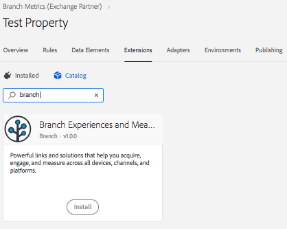
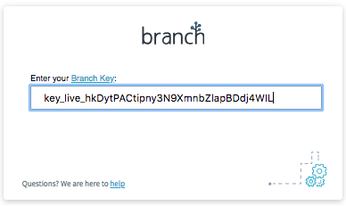

[](https://cocoapods.org/pods/AdobeBranchExtension)
[](https://cocoapods.org/pods/AdobeBranchExtension)
[](https://cocoapods.org/pods/AdobeBranchExtension)
[](https://github.com/Carthage/Carthage)


# AdobeBranchExtension

Add the power of Branch deep linking and analytics to your Adobe Marketing Cloud app.

With Branch's deep linking platform, mobile developers and marketers can leverage
their app content to improve discoverability and optimize install campaigns.

This is the Branch extension for the Adobe Marketing Cloud iOS library.

## Features
1. Deep Link into your app's content.
2. Track Adobe Actions and States along with deep link sessions on the Branch dashboard to optimize your app's marketing and virility reach.
3. Generate Branch short URLs in your app.
4. Show a share sheet with a short URL in your app.

## Requirements
- iOS 10
- Adobe Core Platform 1.0.2beta2
- Branch SDK version 0.25.9 or above.
- For the Android counterpart, if applicable: Android API 14, 4.0.1

## Example
An example app can be found in the AdobeBranchExtension-iOS repository, in the `Examples/AdobeBranchExample`
project.

- [AdobeBranchExample Project](https://github.com/BranchMetrics/AdobeBranchExtension-iOS/tree/master/Examples/AdobeBranchExample)
- [AdobeBranchExtension-iOS Repository](https://github.com/BranchMetrics/AdobeBranchExtension-iOS)

## Installation & Usage
Here's a brief outline of how to use the AdobeBranchExtension in your app:

1. You'll need to configure your app and get a Branch API key in the Branch Metrics dashboard.

   [Configuring  your dashboard and getting a Branch key](https://docs.branch.io/pages/dashboard/integrate/)
2. For deep linking, you'll need to add associated domains for universal links as described in the Branch docs here:

   [Configure associated domains](https://docs.branch.io/pages/apps/ios/#configure-associated-domains)
   [Configure entitlements](https://docs.branch.io/pages/apps/ios/#configure-entitlements)
3. Also add an app URI scheme for you app for deep linking.

   [Configure your Info.plist for URI schemes](https://docs.branch.io/pages/apps/ios/#configure-infoplist)
4. In the Adobe dashboard, activate Branch and add your Branch key to your app's configuration.

   Activate Branch:

   

   Add your Branch key:

   
5. Add the AdobeBranchExtension to your app's Podfile.

        pod 'AdobeBranchExtension'

6. Run `pod install` and `pod update` do install the latest version of the extension.
7. Add some code to you AppDelegate class to activate the AdobeBranchExtension:

```
    #import <AdobeBranchExtension/AdobeBranchExtension.h>
    ...
- (BOOL)application:(UIApplication *)application didFinishLaunchingWithOptions:(NSDictionary *)launchOptions {
    ...
    [ACPCore registerExtension:[AdobeBranchExtension class] error:&error]
    ...
    return YES; // Important! If you return `NO` iOS will not handle deep linking as expected.
}
```

Add deep link handlers in your app delegate class in two places:

```
- (BOOL)application:(UIApplication *)application
        openURL:(NSURL *)url
        options:(NSDictionary<UIApplicationOpenURLOptionsKey,id> *)options {
    [AdobeBranchExtension application:application openURL:url options:options];
    return YES;
}

- (BOOL)application:(UIApplication *)application
        continueUserActivity:(NSUserActivity *)userActivity
        restorationHandler:(void(^)(NSArray<id<UIUserActivityRestoring>> * __nullable restorableObjects))restorationHandler {
    [AdobeBranchExtension application:application continueUserActivity:userActivity];
    return YES;
}
```


Congratulations! With those seven quick and easy steps you've installed and activated the AdobeBranchExtension.

## Implementing Branch Features
Once you've added the AdobeBranchExtension and Branch, you can always use Branch features directly or use the
features through the  AdobeBranchExtension interface.

[You can learn about using the Branch features here, in the Branch documentation for iOS.](https://github.com/BranchMetrics/ios-branch-deep-linking#init-branch-session-and-deep-link-routing-function)

Below outlines using Branch features through the AdobeBranchExtension.

### Deep Linking
When you've implemented the code above you're ready to start listen for deep links.

 Add a `NSNotificationCenter` listener for deep links:

     // Listen for deep links:
    [[NSNotificationCenter defaultCenter]
        addObserver:self
        selector:@selector(showDeepLinkNotification:)
        name:ABEBranchDeepLinkNotification
        object:nil];


[Here's an example that shows how to add a deep link observer.](https://github.com/BranchMetrics/AdobeBranchExtension-iOS/blob/master/Examples/AdobeBranchExample/AdobeBranchExample/ProductListViewController.m#L38)

And add a handler for the listener:

```
- (void) showDeepLinkNotification:(NSNotification*)notification {
    NSDictionary*data = notification.userInfo;
    Product*product = Product.new;
    product.name        = data[ABEBranchLinkTitleKey];
    product.summary     = data[ABEBranchLinkSummaryKey];
    product.imageName   = data[ABEBranchLinkUserInfoKey][@"imageName"];
    product.URL         = data[ABEBranchLinkCanonicalURLKey];
    product.imageURL    = data[ABEBranchLinkImageURLKey];

    ProductViewController *pvc =
        [self.storyboard instantiateViewControllerWithIdentifier:@"ProductViewController"];
    pvc.title = product.name;
    pvc.product = product;
    [self.navigationController pushViewController:pvc animated:YES];
}
```
[Here's the working example that shows the notification handler.](https://github.com/BranchMetrics/AdobeBranchExtension-iOS/blob/master/Examples/AdobeBranchExample/AdobeBranchExample/ProductListViewController.m#L45)

### Track Action and State
When you track actions and state in Adobe Launch, the action and state messages are sent to Branch too and shown on the
Branch dashboards. This allows you to track the effectiveness of deep link campaigns and viral sharing in your app's actions.

Here's an example of tracking app state via Adobe Launch:

    [ACPCore trackState:@"VIEW" data:@{
        @"name":        self.product.name,
        @"revenue":     @"200.0",
        @"currency":    @"USD"
    }];

### Show a Share Sheet
Here's an example of showing a share sheet that allows the user to share a Branch short URL deep link:

    ACPExtensionEvent* shareSheetEvent =
        [ACPExtensionEvent extensionEventWithName:ABEBranchEventNameShowShareSheet
            type:ABEBranchEventType
            source:ABEBranchEventSource
            data:@{
                ABEBranchLinkTitleKey:          self.product.name,
                ABEBranchLinkSummaryKey:        self.product.summary,
                ABEBranchLinkImageURLKey:       self.product.imageURL,
                ABEBranchLinkCanonicalURLKey:   self.product.URL,
                ABEBranchLinkCampaignKey:       @"Sharing",
                ABEBranchLinkShareTextKey:      @"Check out this Branch swag!",
                ABEBranchLinkTagsKey:           @[ @"Swag", @"Branch"],
                ABEBranchLinkUserInfoKey:       @{ @"imageName": self.product.imageName }
            }
            error:&error];


[Here's the example in context of the example.](https://github.com/BranchMetrics/AdobeBranchExtension-iOS/blob/master/Examples/AdobeBranchExample/AdobeBranchExample/ProductViewController.m#L37-L62)

### Generate Branch short links in you app
Here's an example that shows how to create a Branch short URL via the AdobeBranchExtension interface.

Note that `dispatchEventWithResponseCallback` is used to dispatch the event so that the short URL can be passed in the
response.

        NSError*error = nil;
        ACPExtensionEvent* createLinkEvent =
            [ACPExtensionEvent extensionEventWithName:ABEBranchEventNameCreateDeepLink
                type:ABEBranchEventType
                source:[NSBundle mainBundle].bundleIdentifier
                data:@{
                    ABEBranchLinkTitleKey:          @"Branch Glasses",
                    ABEBranchLinkSummaryKey:        @"Look stylish -- Branch style -- in these Branch sun glasses.",
                    ABEBranchLinkImageURLKey:       @"https://cdn.branch.io/branch-assets/1538165719615-og_image.jpeg",
                    ABEBranchLinkCanonicalURLKey:   @"https://branch.io/branch/Glasses.html",
                    ABEBranchLinkCampaignKey:       @"Adobe",
                    ABEBranchLinkTagsKey:           @[ @"Swag", @"Branch"],
                    ABEBranchLinkUserInfoKey: @{
                        @"imageName":   @"glasses",
                        @"linkDate":    [NSDate date].description
                    }
                }
                error:&error];
        if (error) {
            NSLog(@"Error create event: %@.", error);
            return;
        }
        [ACPCore dispatchEventWithResponseCallback:createLinkEvent
            responseCallback:^ (ACPExtensionEvent*responseEvent) {
                dispatch_async(dispatch_get_main_queue(), ^ {
                    [self showCreatedLink:responseEvent];
                });
            }
            error:&error];
        if (error) {
            NSLog(@"Error dispatching event: %@.", error);
        }
        break;

[Here's a link to the example in context.](https://github.com/BranchMetrics/AdobeBranchExtension-iOS/blob/master/Examples/AdobeBranchExample/AdobeBranchExample/ProductListViewController.m#L123-L154)

## Author

Edward Smith, esmith@branch.io

## License

AdobeBranchExtension is available under the MIT license. See the LICENSE file for more info.

## Developer Resources

- [Branch Documentation](https://docs.branch.io/)
- [Branch Dashboard](https://dashboard.branch.io/)
- [Adobe Mobile SDK V5](https://launch.gitbook.io/marketing-mobile-sdk-v5-by-adobe-documentation/release-notes)
- [Adobe Branch Mobile Extension UI Plugin](https://github.com/BranchMetrics/adobe-branch-mobile-plugin)
- [Adobe Mobile SDK V5 Docs](https://launch.gitbook.io/marketing-mobile-sdk-v5-by-adobe-documentation/build-your-own-extension)
